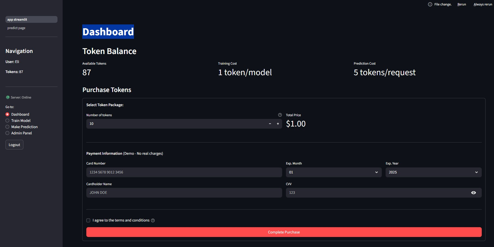
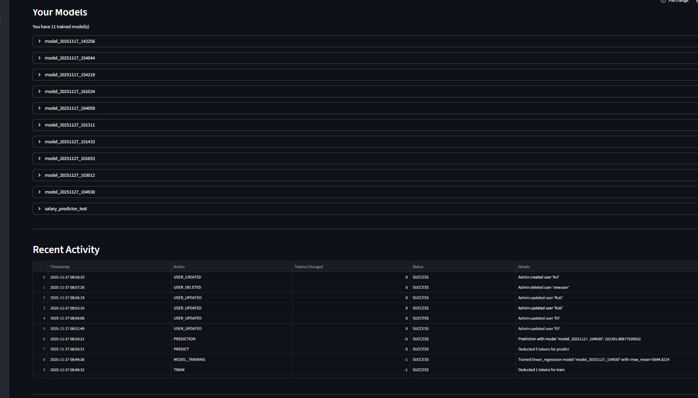
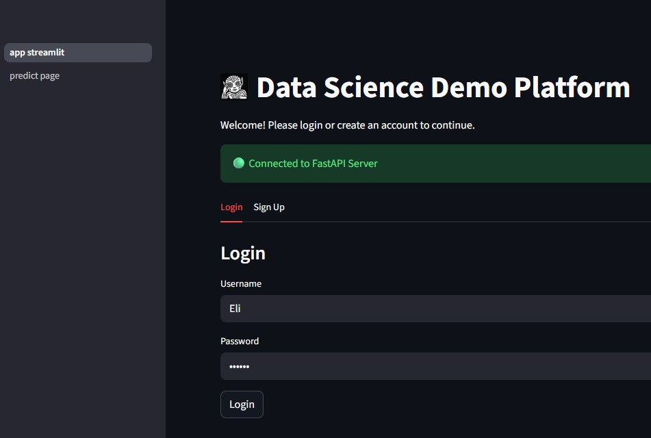

# ML Model Training Platform

A full-stack machine learning platform for training and deploying classification and regression models. Built with FastAPI backend and Streamlit frontend, featuring JWT authentication, token-based access control, and a comprehensive admin panel.

## What is this project?

This platform enables data scientists and ML engineers to:
- **Train ML models** from CSV data with multiple algorithm options
- **Make predictions** using trained models via a simple interface
- **Manage users and tokens** through an admin panel
- **Track usage** with detailed activity logging

## Key Features

- **7 ML Algorithms**: Linear Regression, Logistic Regression, Decision Tree, Random Forest, KNN, SVM, Kernel SVM
- **Token-Based System**: Fair resource allocation (1 token/training, 5 tokens/prediction)
- **JWT Authentication**: Secure, stateless authentication with role-based access
- **Cross-Validation**: Built-in holdout and k-fold cross-validation evaluation
- **Admin Panel**: Complete user management and system analytics

## Screenshots

### Dashboard
<div align="center">
  
  
</div>

### Model Training
<div align="center">
  
</div>

### Making Predictions
<div align="center">
  
  
</div>

### Admin Panel
<div align="center">
  
  
  
  
</div>

### Login
<div align="center">
  
</div>

## Technology Stack

| Layer | Technology |
|-------|------------|
| **Backend** | FastAPI, Uvicorn |
| **Frontend** | Streamlit |
| **Database** | PostgreSQL |
| **ML Engine** | Scikit-learn, Pandas, NumPy |
| **Authentication** | JWT (PyJWT), bcrypt |

## Project Structure

```
Final_Project_v003/
├── app_fastapi/              # FastAPI backend application
│   ├── routers/              # API route handlers (auth, models, admin)
│   ├── database/             # Database operations (connection, users, logs)
│   ├── core/                 # ML core (preprocessing, evaluation, model manager)
│   ├── services/             # Business logic (JWT, tokens, model service)
│   │   └── models/           # ML model implementations
│   ├── data/                 # Data storage (uploads, trained models)
│   └── logs/                 # Application logs
├── app_streamlit/            # Streamlit frontend application
│   ├── pages/                # UI pages
│   │   ├── dashboard/        # User dashboard and token purchase
│   │   ├── train_page/       # Model training interface
│   │   ├── admin_page/       # Admin panel (user management, analytics)
│   │   └── predict_page.py   # Prediction interface
│   └── components/           # Reusable components (API client, utils)
├── scripts/                  # Utility scripts
│   └── setup_admin.py        # Admin privilege management
├── doc/                      # Documentation
├── requirements.txt          # Python dependencies
└── .env                      # Environment configuration
```

## Streamlit Pages

### Dashboard (`pages/dashboard/`)
- **Purpose**: View token balance, trained models, and activity history
- **User Input**: Token purchase form (simulated payment)
- **Server Actions**: Fetches user tokens, models list, and usage logs
- **Output**: Metrics cards, model list with details, activity table, quick stats

### Train Page (`pages/train_page/`)
- **Purpose**: Upload CSV data and train ML models
- **User Input**: CSV file, feature/label selection, model type, parameters
- **Server Actions**: Uploads file, calls `/models/train` endpoint
- **Output**: Data preview, training progress, performance metrics, preprocessing details

### Predict Page (`pages/predict_page.py`)
- **Purpose**: Make predictions using trained models
- **User Input**: Model selection, feature values (manual or JSON)
- **Server Actions**: Calls `/models/predict` endpoint
- **Output**: Prediction result, probability distribution (for classification)

### Admin Page (`pages/admin_page/`)
- **Purpose**: System administration (admin role required)
- **User Input**: User CRUD operations, filters, confirmations
- **Server Actions**: User management, token distribution, log retrieval
- **Output**: User table, token charts, activity logs, model management

## Installation & Setup

### Prerequisites
- Python 3.9+
- PostgreSQL 12+
- pip or conda for package management

### 1. Clone and Install Dependencies

```bash
git clone https://github.com/Bob789/Final_Project_v003.git
cd Final_Project_v003
pip install -r requirements.txt
```

### 2. Configure Environment

Create a `.env` file in the root directory:

```env
# Database Configuration
DB_HOST=localhost
DB_PORT=5432
DB_NAME=ml_platform
DB_USER=your_username
DB_PASSWORD=your_password

# JWT Configuration
JWT_SECRET_KEY=your-secret-key-here
JWT_ALGORITHM=HS256
JWT_EXPIRATION_MINUTES=60
```

### 3. Initialize Database

The database and tables are created automatically on first run. To set up an admin user:

```bash
python scripts/setup_admin.py
```

### 4. Run the Application

**Terminal 1 - Start FastAPI Backend:**
```bash
cd app_fastapi
uvicorn app_fastapi:app --reload --port 8000
```

**Terminal 2 - Start Streamlit Frontend:**
```bash
cd app_streamlit
streamlit run app_streamlit.py --server.port 8501
```

Access the application at: http://localhost:8501

## API Overview

### Authentication Endpoints (`/auth`)
| Method | Endpoint | Description |
|--------|----------|-------------|
| POST | `/auth/signup` | Register new user |
| POST | `/auth/login` | Authenticate and get JWT |
| GET | `/auth/tokens/{username}` | Get token balance |
| POST | `/auth/add_tokens` | Add tokens to account |

### Model Endpoints (`/models`)
| Method | Endpoint | Description |
|--------|----------|-------------|
| POST | `/models/train` | Train a new model |
| POST | `/models/predict` | Make prediction |
| GET | `/models` | List all models |
| GET | `/models/{name}` | Get model details |
| DELETE | `/models/{name}` | Delete model |

### Admin Endpoints (`/auth` - admin only)
| Method | Endpoint | Description |
|--------|----------|-------------|
| GET | `/auth/users` | List all users |
| POST | `/auth/users` | Create user |
| PUT | `/auth/users/{username}` | Update user |
| DELETE | `/auth/users/{username}` | Delete user |
| GET | `/auth/usage_logs` | Get activity logs |

Full API documentation available at: http://localhost:8000/docs

## Documentation

- [Architecture Overview](doc/architecture.md) - System design and data flows
- [API Reference](doc/api_reference.md) - Complete endpoint documentation
- [Database Schema](doc/database_schema.md) - Tables and relationships
- [Streamlit Pages](doc/streamlit_pages.md) - Detailed UI documentation
- [Deployment Guide](doc/deployment.md) - Production deployment instructions
- [Scripts Documentation](scripts/README.md) - Utility scripts guide

## Token System

| Operation | Cost | Description |
|-----------|------|-------------|
| Training | 1 token | Train any ML model |
| Prediction | 5 tokens | Make a prediction |
| View Models | Free | List and view model details |

New users receive **10 tokens** on signup. Failed operations are automatically refunded.

## License

This project is for educational purposes.

---

*Last Updated: 2025-11-27*